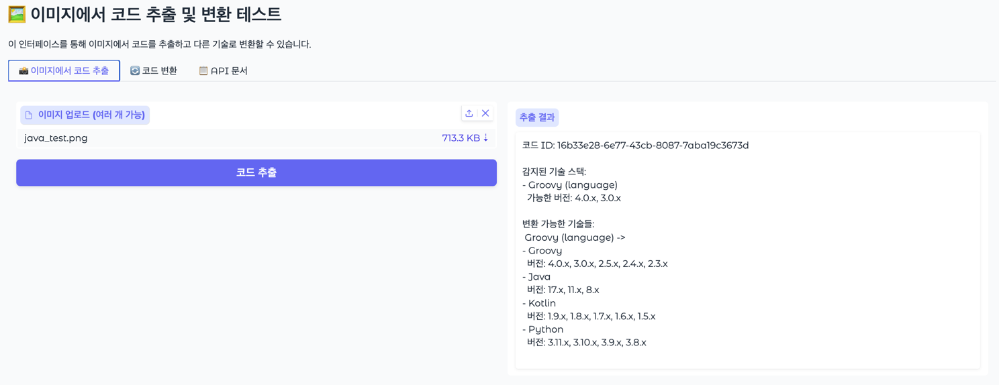
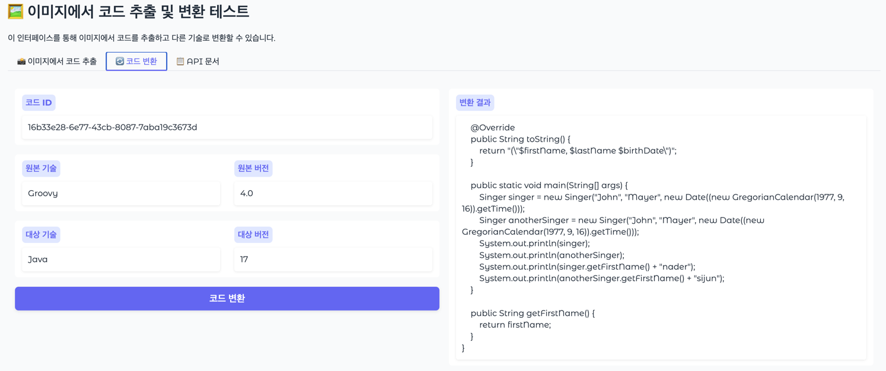
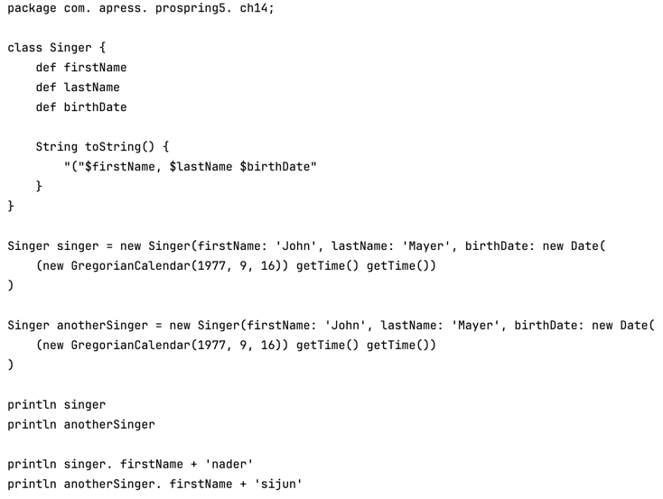
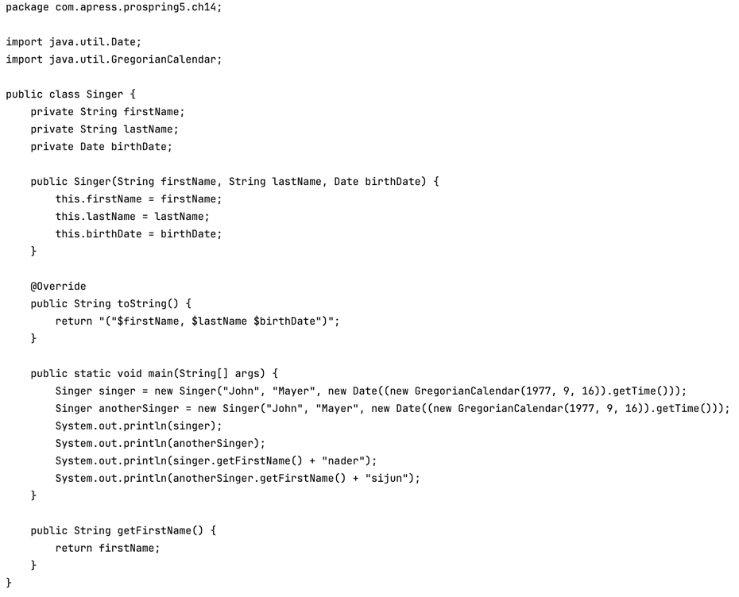
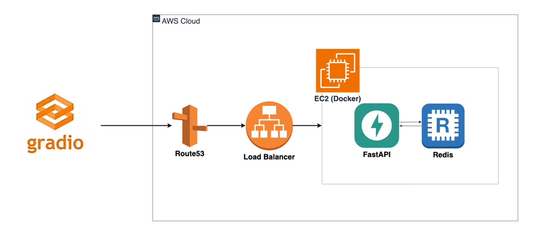

# LegacyLift AI (팀 voicescout)

## 📌 개요
**"오래된 개발 서적을 현대적으로 되살리고, 언어 간 학습 장벽을 허무는 AI 도구"**

이 프로젝트는 두 가지 핵심 문제를 해결하기 위해 시작되었습니다:

### 1. 환경적 가치: 버려지는 개발 서적 구원하기
개발 서적들은 기술 발전 속도가 빨라 금세 구식이 되어 버려집니다. 도서관에서 빌린 Spring 책이 Java 1.8 기반이라 실행조차 안 되는 상황... 이런 귀중한 지식 자원들이 단순히 버전 차이 때문에 폐기되는 것이 너무 아깝습니다. 

### 2. 학습적 가치: 기존 지식을 활용한 효율적 학습
한 언어나 프레임워크만 아는 개발자가 새로운 기술을 배울 때, 기존 지식을 새로운 기술로 변환해서 비교 학습하면 훨씬 빠르고 깊이 있게 이해할 수 있습니다.

**→ 이 시스템은 오래된 책의 코드 예제를 최신 기술로 변환하여 다시 생명을 불어넣고, 개발자들의 크로스 플랫폼 학습을 돕는 AI 기반 도구입니다.**

## 🎯 문제 정의 및 기대 효과

### 해결하고자 하는 문제

#### 📚 개발 서적의 짧은 생명주기 문제
- **빠른 기술 변화**: 개발 기술의 급속한 발전으로 2-3년 된 책도 구식이 되어버림
- **버전 호환성 문제**: Java 1.8 기반 Spring 책, Python 2.7 기반 Django 책 등 실행조차 안 되는 예제들
- **환경적 낭비**: 내용은 좋지만 기술 버전 차이로 폐기되는 수많은 개발 서적들
- **접근성 저하**: 도서관이나 중고서점의 개발 서적들이 실용성을 잃어가는 현실

#### 🔄 언어 간 학습 장벽 문제  
- **처음부터 다시 배우기**: 이미 알고 있는 개념을 새로운 언어로 다시 배워야 하는 비효율성
- **문법 차이의 혼란**: 같은 로직이지만 언어별로 다른 문법과 패턴으로 인한 학습 어려움
- **비교 학습 자료 부족**: 기존 지식과 연결해서 설명하는 학습 자료의 부족
- **학습 동기 저하**: 이미 아는 내용을 다시 배우는 것 같은 느낌으로 인한 흥미 감소

### 기대 효과

#### 🌍 지속가능한 개발 교육 생태계
- **서적 생명 연장**: 오래된 개발 서적을 최신 기술로 업데이트하여 재활용
- **환경 보호**: 물리적 자원 낭비 줄이고 지식 자원의 지속적 활용
- **교육 접근성 향상**: 도서관과 중고서점의 개발 서적들이 다시 실용적 가치를 가짐
- **지식 보존**: 좋은 개발 원리와 패턴들이 기술 변화에도 불구하고 계속 전수됨

#### 🚀 효율적인 크로스 플랫폼 학습
- **연결 학습**: 기존 지식을 새로운 기술과 연결하여 더 빠른 이해
- **비교 학습**: 같은 로직의 다른 구현 방식을 비교하며 깊이 있는 학습
- **학습 동기 증진**: 이미 아는 것을 확장하는 방식으로 성취감과 자신감 향상
- **실무 적용력 강화**: 다양한 기술 스택 간 변환 능력으로 실무 적응력 향상

## ✅ Upstage API 활용

### 1. Document Parse
- **OCR 기능**: 이미지에서 텍스트 추출

### 2. Solar LLM (solar-pro2-preview)
- **코드 분석**: 추출된 텍스트에서 실제 코드 부분만 정제하고 분리
- **기술 스택 식별**: 프로그래밍 언어, 프레임워크, 라이브러리 자동 감지
- **버전 추론**: 코드 패턴과 문법을 분석하여 기술 스택의 버전 추정
- **변환 후보 제안**: 현재 기술 스택에 적합한 마이그레이션 옵션 추천
- **코드 변환**: 원본 기술에서 대상 기술로의 스마트한 코드 변환

### 3. Embedding (embedding-query)
- **기술 변환 지식 베이스**: `document.json`에 저장된 주요 변환 가이드를 임베딩으로 변환
- **벡터 저장소**: 임베딩된 가이드를 FAISS에 저장

## 🚀 주요 기능

### 📚 개발 서적 부활 시스템
**"오래된 책도 최신 기술로 다시 태어납니다!"**

#### 📸 책 사진 → 실행 가능한 코드
- **간편한 업로드**: 개발 서적의 코드 예제 페이지를 사진으로 촬영하여 업로드
- **정확한 코드 추출**: AI OCR이 책 속 코드만 정확히 분리하여 추출
- **구조 보존**: 원본 코드의 들여쓰기와 포맷팅을 그대로 유지

#### 🔄 다양한 변환 옵션
- **같은 기술, 다른 버전**: Java 1.8 → Java 17, React 16 → React 18
- **다른 기술 스택**: Spring → FastAPI, jQuery → React, Express → Fastify  
- **현대적 업그레이드**: Python 2.7 → Python 3.11, JavaScript ES5 → TypeScript


## 🖼️ 데모

### 📹 데모 영상
[> LegacyLift AI 데모 유튜브 링크 <](https://www.youtube.com/watch?v=4sVqXG8gpMw)

**📱 실제 사용 과정을 영상으로 확인하세요!**
- 개발 서적 사진 촬영부터 코드 변환까지 전 과정
- Groovy Script를 최신 Java로 업그레이드하는 과정

### 웹 인터페이스 접속
- **메인 페이지**: `https://legacylift-ai.com/gradio/`
- **API 문서**: `https://legacylift-ai.com/docs` (FastAPI Swagger UI)

### 주요 화면
1. **이미지 업로드 탭**: 코드가 포함된 이미지를 드래그 앤 드롭으로 업로드
2. **코드 변환 탭**: 추출된 코드를 다른 기술로 변환

### 📸 스크린샷 예시
#### 1. *간단하고 직관적인 웹 인터페이스*


#### 2. *AI가 책에서 추출한 코드와 기술 스택 분석 결과*



#### 3. *변환 전 Groovy Script 코드*



#### 4. *변환 후 Java 코드*


## 🔬 기술 구현 요약

### AI 파이프라인 구조
```
1. 이미지 입력 → DocumentPasing → 코드 정제 → 기술 스택 분석 → 변환 후보 생성
2. 변환 후보 선택 → 코드 변환
```

### 핵심 Runnable 컴포넌트
1. **DocumentParser**: Upstage Document Parse API를 활용한 이미지 텍스트 추출
2. **CodeCleaner**: Solar LLM을 사용한 OCR 결과 정제 및 코드 분리
3. **CodeAnalyser**: 기술 스택 식별 및 버전 분석
4. **CandidateFinder**: 변환 가능한 기술 스택 추천
5. **CodeGenerator**: 대상 기술로의 코드 변환 수행

### LangChain 활용
- **Runnable 체인**: 각 처리 단계를 연결한 파이프라인 구성
- **Structured Output**: Pydantic 모델을 통한 일관된 데이터 구조
- **Prompt Engineering**: 각 단계별 최적화된 프롬프트 설계
- **콜백 시스템**: 처리 과정 모니터링 및 디버깅

### 데이터 플로우
1. 이미지 → 텍스트 추출 (DocumentParse)
2. 텍스트 → 코드 정제 (CodeCleaner)
3. 코드 → 기술 분석 (CodeAnalyser)
4. 기술 정보 → 변환 후보 생성 (CandidateFinder)
5. RAG 검색 → 변환 후보 선택 (DocumentFinder)
6. 원본 + 대상 기술 → 변환된 코드 (CodeGenerator)

## 🧰 기술 스택 및 시스템 아키텍처

### 백엔드
- **Python 3.12**: 메인 개발 언어
- **FastAPI**: 고성능 웹 프레임워크 및 API 서버
- **LangChain**: AI 파이프라인 구성 및 LLM 통합
- **Redis**: 세션 관리 및 캐싱
- **FAISS**: 벡터 저장소

### AI/ML
- **Upstage Document Parse API**
- **solar-pro2-preview**
- **Upstage embedding-query**
- **FAISS**

### 프론트엔드
- **Gradio**: 웹 UI 프레임워크

### 인프라
- **Docker**: 컨테이너화, 배포 용이
- **uvicorn**: ASGI 서버

### 시스템 아키텍처



## 🔧 설치 및 사용 방법

### 🌐 방법 1: 웹에서 바로 사용하기 (권장)
- **메인 페이지**: https://legacylift-ai.com/gradio/

- 🚀 사용 방법
    1. 웹사이트 접속
    2. 개발 서적의 코드 페이지 사진 촬영
    3. 이미지 업로드
    4. 변환하고 싶은 기술 스택 선택
    5. 결과 확인 및 복사

### 🐳 방법 2: Docker Compose로 로컬 실행

#### 📋 사전 요구사항
- Docker & Docker Compose
- Upstage API 키

#### 🛠️ 설치 과정
```bash
# 1. 리포지토리 클론
git clone https://github.com/voice-scout-AI/DAIC-voicescoutAI.git
cd DAIC-server

# 2. 환경 변수 설정
cp .env.example .env
vi .env

# 3. Docker Compose로 실행
docker-compose up -d

# 4. 접속 확인
# 웹 인터페이스: http://localhost:8000/gradio
# API 문서: http://localhost:8000/docs
```

## 📁 프로젝트 구조

```bash
DAIC-server/
├── README.md               # 프로젝트 설명서
├── requirements.txt        # Python 의존성 목록
├── Dockerfile             # Docker 컨테이너 설정
├── docker-compose.yml     # 다중 서비스 Docker 구성
├── .env.example           # 환경 변수 설정 (변경 필요)
│
├── app/                   # 메인 애플리케이션
│   ├── main.py           # FastAPI 서버 엔트리포인트
│   │
│   ├── core/             # 핵심 설정 및 유틸리티
│   │   ├── config.py     # 환경 설정 관리
│   │   ├── prompts.py    # 프롬프트 관리
│   │   └── state.py      # 상태 관리
│   │
│   ├── services/                # 비즈니스 로직 서비스
│   │   ├── process_images.py    # 이미지 처리 체인
│   │   └── transform_code.py    # 코드 변환 체인
│   │
│   ├── runnables/        # LangChain Runnable 컴포넌트
│   │   ├── document_parser.py   # OCR 문서 파싱
│   │   ├── code_cleaner.py      # 코드 정제
│   │   ├── code_analyser.py     # 기술 스택 분석
│   │   ├── candidate_finder.py  # 변환 후보 탐색
│   │   │
│   │   ├── document_finder.py   # 변환 가능한 기술 스택검색
│   │   └── code_generator.py    # 코드 변환 생성
│   │
│   ├── rag/              # RAG (검색 증강 생성) 관련
│   │   ├── vector_store.py      # 벡터 데이터베이스 관리
│   │   └── document.json        # 변환 가능한 기술 스택 목록
│   │
│   ├── ui/               # 사용자 인터페이스
│   │   └── gradio_interface.py  # Gradio 웹 UI
│   │
│   ├── statics/          # 정적 파일 (CSS, JS, 이미지)
│   ├── uploads/          # 업로드된 이미지 임시 저장
│   └── test/             # 테스트 코드
│
└── venv/                 # Python 가상환경
```

## 🧑‍🤝‍🧑 팀원 소개

| 이름  | 역할          | GitHub                                    |
| --- | ----------- | -------------------------------------------- |
| 김은종 | 팀장 / 백엔드, AI 개발 | [@developer1](https://github.com/philosophia301) |
| 홍지연 | 프론트엔드 개발      | [@developer2](https://github.com/redzzzi) |


## 💡 참고 자료 및 아이디어 출처

* [Upstage Document Parse API](https://console.upstage.ai/docs/capabilities/document-digitization/document-parsing) - OCR 및 문서 분석 API
* [LangChain Documentation](https://python.langchain.com/docs/introduction/) - AI 애플리케이션 개발 프레임워크
* [FastAPI Documentation](https://fastapi.tiangolo.com/) - 고성능 웹 API 프레임워크
* [Gradio Documentation](https://gradio.app/docs/) - 머신러닝 모델 UI 구축
